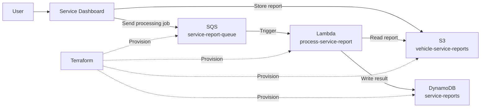
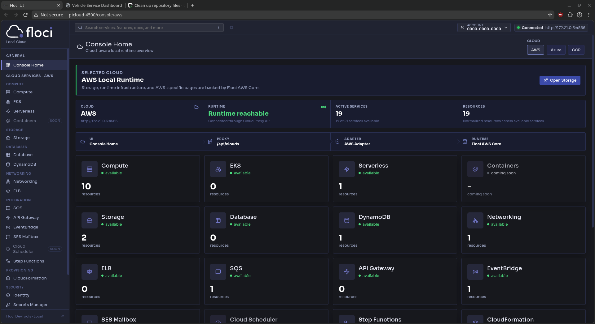
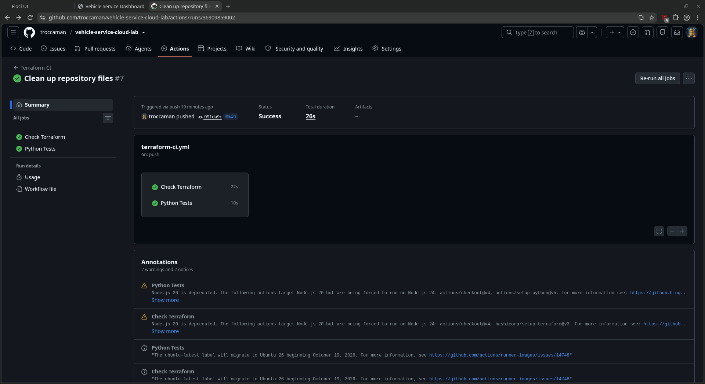
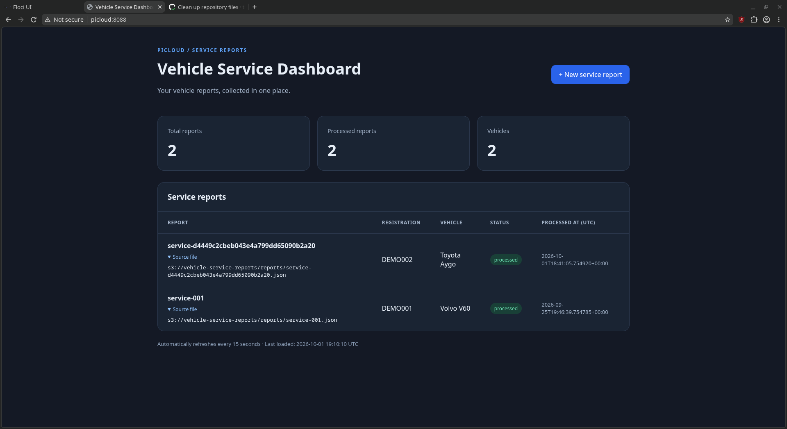

# Vehicle Service Cloud Lab

A local AWS-compatible serverless lab for processing vehicle service reports with Terraform, Python, Docker and CI.

Built on a Raspberry Pi using Floci to provide local AWS-compatible services. The project explores Infrastructure as Code, event-driven architecture, automated testing and security scanning without requiring an AWS account.

## What the lab does

A small web dashboard is used to create vehicle service reports.

When a report is submitted:

1. The dashboard stores the report as JSON in S3.
2. The dashboard sends a processing message to SQS.
3. SQS triggers a Python Lambda function.
4. Lambda reads the report from S3.
5. The processed result is written to DynamoDB.



## Technology

| Component | Purpose |
|---|---|
| Raspberry Pi 5 | Hosts the lab |
| Docker | Runs the local services |
| Floci | Provides AWS-compatible APIs locally |
| Terraform | Defines the infrastructure as code |
| S3 | Stores service report JSON files |
| SQS | Queues reports for processing |
| Lambda / Python | Processes reports |
| DynamoDB | Stores processed report data |
| IAM | Controls permissions between services |
| GitHub Actions | Runs automated CI checks |
| pytest | Tests the Python processing logic |
| Trivy | Scans Terraform for security issues |

> **Note:** This project does not deploy resources to Amazon AWS. Floci provides local AWS-compatible APIs used by the Terraform AWS provider and boto3.

## Infrastructure as Code

The infrastructure is defined in `terraform/`.

Terraform manages:

- S3 bucket
- SQS queue
- DynamoDB table
- Lambda function
- IAM role and policies
- SQS to Lambda event source mapping

The AWS provider is configured to use the local Floci endpoint instead of Amazon AWS. This allows the same Terraform concepts and AWS provider resources to be used without creating resources in a real AWS account.

Terraform state, downloaded providers and generated build artifacts are intentionally excluded from Git.

### Local AWS environment



AWS-compatible services are provided locally by Floci running on the Raspberry Pi.

## CI and security

GitHub Actions runs automatically on pushes and pull requests to `main`.

The workflow is divided into separate infrastructure and application test jobs.

### Terraform checks

The Terraform pipeline:

1. Checks out the repository.
2. Builds the Lambda deployment ZIP.
3. Checks Terraform formatting.
4. Initializes Terraform without a remote backend.
5. Validates the Terraform configuration.
6. Scans the Terraform configuration with Trivy.

High and critical Trivy findings fail the pipeline.

During development, the security scan identified several issues, including missing S3 public-access protection and missing SQS encryption. These findings were corrected in the Terraform configuration.

The S3 bucket now blocks public access and uses server-side AES-256 encryption. The SQS queue uses server-side encryption.

Trivy's `AWS-0132` check requires S3 encryption using a customer-managed AWS KMS key. Because this lab runs locally with Floci rather than Amazon AWS KMS, that specific check is explicitly documented and excluded. Other HIGH and CRITICAL findings continue to fail the CI pipeline.

This keeps the security exception visible instead of silently disabling security scanning.

### Python tests

A separate CI job installs the Python test dependencies and runs pytest.

The tests verify that:

- malformed processing events are rejected;
- a valid report can be read from a mocked S3 service;
- the report data is processed correctly;
- the processed result is written to a mocked DynamoDB table.

The tests do not require the local Floci environment. This allows them to run independently on clean GitHub-hosted runners.

### CI pipeline



Both the Terraform checks and Python unit tests run automatically in GitHub Actions.

The jobs run independently, allowing infrastructure validation and application testing to be checked separately.

## End-to-end validation

The complete application flow was tested end-to-end in the local environment.

A new vehicle service report was submitted through the dashboard and processed through the complete chain:

```text
Dashboard
   │
   ├──> S3: Store service report
   │
   └──> SQS: Send processing job
              │
              v
           Lambda
              │
              ├──> Read report from S3
              │
              v
          DynamoDB
```

The resulting record was then verified directly in DynamoDB using the AWS CLI against the local Floci endpoint.

This provides a different level of validation from the unit tests. pytest tests the Python processing logic in isolation, while the end-to-end test verifies that the dashboard, S3, SQS, Lambda and DynamoDB work together as a complete system.

### End-to-end result



The dashboard shows the completed service reports after they have been processed by the Lambda function and stored in DynamoDB.

## Repository structure

```text
.
├── .github/
│   └── workflows/
│       └── terraform-ci.yml
├── dashboard/
│   ├── templates/
│   │   ├── index.html
│   │   └── new-report.html
│   ├── app.py
│   ├── compose.yaml
│   ├── Dockerfile
│   └── requirements.txt
├── docs/
│   └── images/
│       ├── dashboard.png
│       ├── floci.png
│       └── github-actions.png
├── functions/
│   └── process_service_report.py
├── terraform/
│   ├── .terraform.lock.hcl
│   ├── lambda.tf
│   ├── main.tf
│   ├── provider.tf
│   └── sqs-lambda.tf
├── tests/
│   └── test_process_service_report.py
├── .gitignore
├── requirements-test.txt
└── README.md
```

## What I learned

The main goal of this project was not simply to reproduce AWS services locally, but to understand how the different parts of a DevOps workflow fit together.

Some of the main lessons were:

- defining infrastructure with Terraform instead of creating resources manually;
- understanding how Terraform providers and resources work;
- using queues to separate an application from background processing;
- working with S3, SQS, Lambda, DynamoDB and IAM concepts;
- applying least-privilege permissions between services;
- building reproducible CI jobs on clean runners;
- separating application code, infrastructure and tests;
- using automated security scanning as a CI gate;
- investigating security findings instead of blindly suppressing them;
- understanding when a documented security exception is appropriate;
- using unit tests and end-to-end tests for different purposes.

One useful CI failure occurred when `terraform validate` could not find the Lambda ZIP file.

The build directory was intentionally excluded from Git, which meant that the Lambda package available on the Raspberry Pi did not exist on a clean GitHub Actions runner.

Instead of committing the generated ZIP file, the CI workflow was changed to build the Lambda deployment package before Terraform validation.

This made the pipeline reproducible instead of depending on an artifact that happened to exist on the development machine.

Another useful lesson was the difference between the local development environment and a GitHub-hosted runner. The Terraform AWS provider can access Floci through `localhost:4566` on the Raspberry Pi, but `localhost` inside GitHub Actions refers to the GitHub runner itself.

For that reason, GitHub Actions is used for validation, security scanning and automated tests, while the actual Floci infrastructure remains local to the Raspberry Pi.

## Status

The lab currently demonstrates:

- local AWS-compatible infrastructure;
- Infrastructure as Code with Terraform;
- S3-based report storage;
- asynchronous processing with SQS;
- event-driven processing with Lambda;
- DynamoDB integration;
- IAM roles and least-privilege policies;
- Docker-based local services;
- automated Terraform formatting and validation;
- automated Python unit tests;
- Infrastructure as Code security scanning with Trivy;
- security checks enforced through CI;
- a verified end-to-end processing flow.

The project is intended as a learning and portfolio lab rather than a production Amazon AWS deployment.